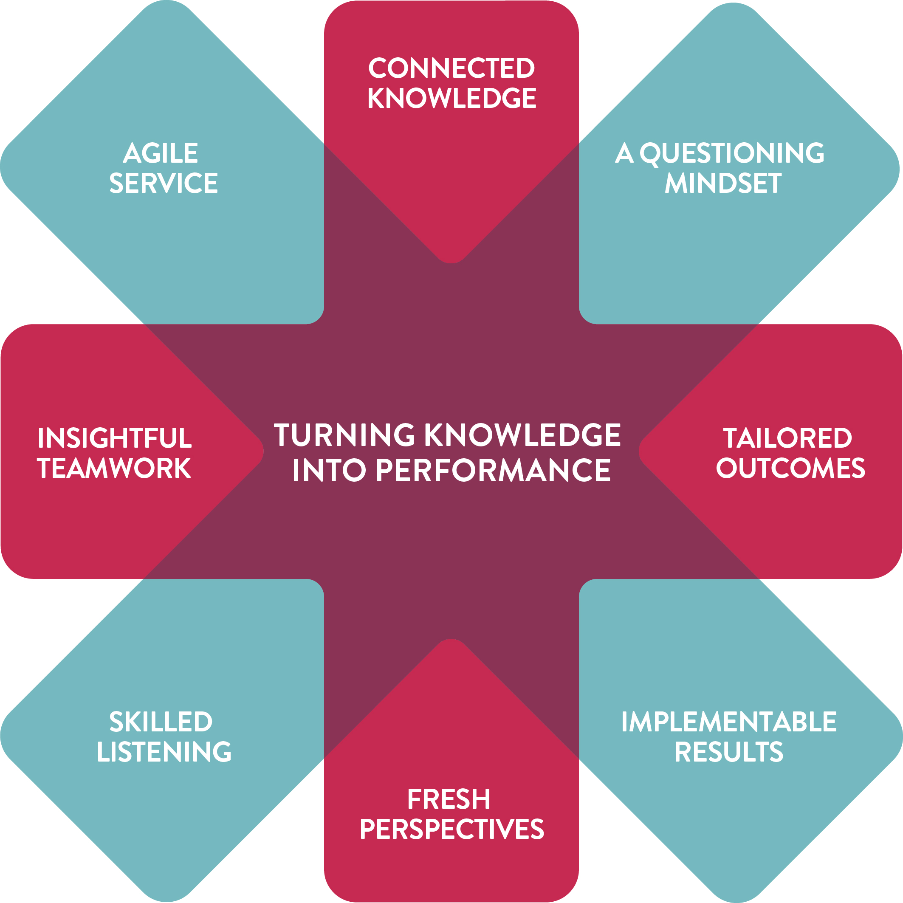

# OUR STORY

For over two decades MartinJenkins has specialised in providing high calibre organisational, financial, economic and public policy services to clients in New Zealand and beyond. Our energetic team of consultants has a wealth of in-depth knowledge and skills in financial and organisational management, process and business improvement, employment relations, economics, research, evaluation and public policy. By connecting this skill set and applying fresh thinking, we significantly lift our clients’ performance.

## TURNING KNOWLEDGE INTO PERFORMANCE
For over two decades MartinJenkins has specialised in providing high calibre organisational, financial, economic and public policy services to clients in New Zealand and beyond. Our energetic team of more than 40 consultants has a wealth of in-depth knowledge and skills in financial and organisational management, process and business improvement, employment relations, economics, research, evaluation and public policy. By connecting this skill set and applying fresh thinking, we significantly lift our clients’ performance.

## OUR JOURNEY
MartinJenkins’ roots lie in the shifting sands of state sector reform in the early 90’s, when three top managers at the State Services Commission stepped out on their own.

Much has changed since then – our name, our growth into one of New Zealand’s leading strategic consultancies, and the depth and breadth of our staff’s experience. Some things have not changed – we remain the ‘savvy operators’, the ‘safe pair of hands’ that politicians and chief executives still turn to, to get things done.

MartinJenkins has played a quietly constructive role in many of the advances that have helped shape New Zealand society in the last twenty years. Not only has the firm been asked to do the high level, analytical thinking on organisational strategy and design, and employment relations, it has also been at the practical end of making the changes happen. As the firm’s reputation has grown around state sector reform, it has also been invited to carry out assignments for governments in Asia, the Pacific and parts of Africa.

From the outset, MartinJenkins has focused on hiring top quality, senior people with a track record in different fields. Growth has followed as the company’s expertise has broadened and deepened around key people.

Unlike other consulting firms, we have always maintained a relatively ‘flat’ structure with a predominance of experienced, self-starting senior staff. For our clients, that means they will always work with senior, experienced people who are capable of solving the hard issues.

MartinJenkins’ sphere of operation stretches across and beyond New Zealand. In 2011, we consolidated our presence in the upper North Island with the establishment of a dedicated office in Auckland, and a conscious strategy of tailoring our services and deep knowledge of government and public policy to the needs of our corporate and local government clients.
